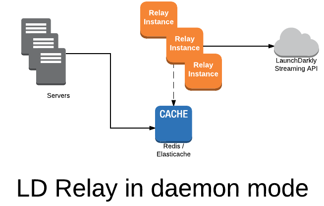

# 🚀 Feature Toggles com LaunchDarkly + Relay Proxy

Este projeto é uma **Prova de Conceito (PoC)** que demonstra como integrar o [LaunchDarkly](https://launchdarkly.com/) com uma api .NET utilizando o **modo daemon** via **Relay Proxy**.

## 🐳 Como iniciar o projeto

#### ✅ Pré-requisitos

- [.NET 9](https://dotnet.microsoft.com/en-us/download/dotnet/9.0)
- [Docker](https://www.docker.com/)

#### ▶️ Subindo a aplicação

1. **Inicie o Docker**.
2. Com o Docker ativo, execute o projeto `POC.LaunchDarkly.Api.AppHost`:

ℹ️ O Aspire se encarregará de subir os projetos dependentes definidos na solução.

## 🧪 Como testar

#### 📬 Collection do Postman

Na pasta [`/docs`](./docs), você encontrará a collection Postman com os seguintes endpoints:

- **Relay Proxy**
  - `GET http://localhost:8030/status` → Verifica o status do proxy
  - `GET http://localhost:8030/flags` → Lista todas as feature flags

- **API**
  - `GET /api/v1/emprestimos/simulacao` → Simula um empréstimo
  - `POST /api/v1/emprestimos` → Cria um empréstimo

#### 🌐 Gerenciar Feature Flags

Você pode visualizar e modificar as flags diretamente no portal do LaunchDarkly:

🔗 [https://app.launchdarkly.com](https://app.launchdarkly.com)

👤 **Usuário:** `seu-usuario@exemplo.com`
🔑 **Senha:** `sua-senha`

## 🧠 Arquitetura - Modo Daemon (Relay Proxy)

Nesta PoC, adotei a arquitetura com o **Relay Proxy em modo daemon** como forma de otimizar o consumo de feature flags em ambientes com múltiplos serviços backend.

#### 📌 Cenário de uso

No cenário de uso temos diversos serviços **do tipo backend/server-side**, esse serviços precisariam manter conexões contínuas com o LaunchDarkly para verificar alterações em feature flags. Essa abordagem direta, quando escalada, pode gera:

- Múltiplas conexões simultâneas com o serviço do LaunchDarkly
- Aumento do tráfego e da complexidade na infraestrutura

### 🧠 Solução com Relay Proxy (Modo Daemon)

Com o uso do **Relay Proxy no modo daemon**, centralizamos a comunicação com o LaunchDarkly no próprio proxy, e os serviços backend passam a consultar o Redis (data store persistente) para obter o status das feature flags localmente.

Essa arquitetura traz os seguintes comportamentos:

- O **Relay Proxy** mantém a **única conexão** ativa com o LaunchDarkly, recebendo atualizações em tempo real
- As atualizações são armazenadas no **Redis**, que funciona como uma fonte local de leitura para os serviços
- Os serviços backend acessam as flags diretamente do Redis, sem necessidade de comunicação externa
- A comunicação com o LaunchDarkly é delegada exclusivamente ao Relay Proxy

> 💡 **Importante**: Esta arquitetura é voltada exclusivamente para **SDKs de back-end (server-side)**.  
>  **SDKs client-side** precisam se comunicar diretamente com o LaunchDarkly e **não podem utilizar o Relay Proxy**, pois dependem de conexões individuais e atualizações contínuas diretamente da origem.  

🔗 **Links úteis**

📘 [Documentação oficial do LaunchDarkly](https://launchdarkly.com/docs/)

🧠 [Relay Proxy](https://launchdarkly.com/docs/sdk/relay-proxy)

🐳 [Docker Relay Proxy - Documentação](https://github.com/launchdarkly/ld-relay/blob/master/README.md)

⚙️ [Configurando SDK com Daemon Mode](https://launchdarkly.com/docs/sdk/features/relay-proxy-configuration/daemon-mode)